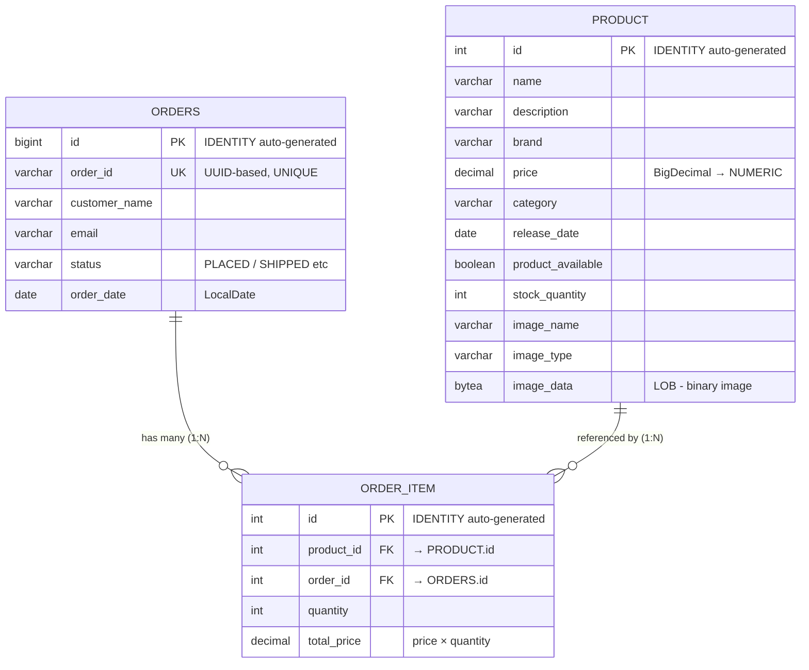

# 📊 SpringEcom — Database Design & Schema

---

## ER Diagram



---

## Table Details

### 1. PRODUCT

| Column | Type | Constraint | JPA Annotation | Notes |
|---|---|---|---|---|
| `id` | `int` | **PK**, auto-increment | `@Id @GeneratedValue(IDENTITY)` | Primary key |
| `name` | `varchar` | — | — | Product name |
| `description` | `varchar` | — | — | Product description |
| `brand` | `varchar` | — | — | Brand name |
| `price` | `decimal` / `numeric` | — | `BigDecimal` | Exact precision for money |
| `category` | `varchar` | — | — | Product category |
| `release_date` | `date` | — | `@JsonFormat("dd-MM-yyyy")` | Formatted for API |
| `product_available` | `boolean` | — | — | In stock flag |
| `stock_quantity` | `int` | — | — | Current stock count |
| `image_name` | `varchar` | — | — | Original filename |
| `image_type` | `varchar` | — | — | MIME type (image/png etc) |
| `image_data` | `bytea` | — | `@Lob` | Binary image stored in DB |

---

### 2. ORDERS (not "order" — reserved SQL keyword)

| Column | Type | Constraint | JPA Annotation | Notes |
|---|---|---|---|---|
| `id` | `bigint` | **PK**, auto-increment | `@Id @GeneratedValue(IDENTITY)` | Internal PK (Long) |
| `order_id` | `varchar` | **UNIQUE** | `@Column(unique = true)` | Business ID: "ORD" + UUID(8 chars) |
| `customer_name` | `varchar` | — | — | Customer name |
| `email` | `varchar` | — | — | Customer email |
| `status` | `varchar` | — | — | Order status (PLACED, etc.) |
| `order_date` | `date` | — | `LocalDate` | Date order was placed |

---

### 3. ORDER_ITEM (join/association entity)

| Column | Type | Constraint | JPA Annotation | Notes |
|---|---|---|---|---|
| `id` | `int` | **PK**, auto-increment | `@Id @GeneratedValue(IDENTITY)` | Primary key |
| `product_id` | `int` | **FK** → `PRODUCT.id` | `@ManyToOne` | Which product |
| `order_id` | `bigint` | **FK** → `ORDERS.id` | `@ManyToOne(fetch = LAZY)` | Which order |
| `quantity` | `int` | — | — | Quantity ordered |
| `total_price` | `decimal` | — | `BigDecimal` | price × quantity |

---

## Relationship Summary

```
┌─────────────┐         ┌──────────────┐         ┌─────────────┐
│   PRODUCT   │         │  ORDER_ITEM  │         │   ORDERS    │
│             │         │              │         │             │
│  id (PK)    │◄───FK───│  product_id  │         │  id (PK)    │
│  name       │         │  order_id    │───FK───►│  order_id   │
│  price      │         │  quantity    │         │  status     │
│  stock_qty  │         │  total_price │         │  email      │
│  ...        │         │  id (PK)     │         │  ...        │
└─────────────┘         └──────────────┘         └─────────────┘

       1 : N                                          1 : N
  (One product can be           (One order has
   in many order items)          many order items)
```

---

## Relationship Types Used

| Relationship | Type | JPA Side | Annotation | FK Location |
|---|---|---|---|---|
| **Order → OrderItem** | **One-to-Many** | Order (parent) | `@OneToMany(mappedBy = "order", cascade = ALL)` | FK in `ORDER_ITEM` table |
| **OrderItem → Order** | **Many-to-One** | OrderItem (owning) | `@ManyToOne(fetch = LAZY)` | `order_id` column in `ORDER_ITEM` |
| **OrderItem → Product** | **Many-to-One** | OrderItem (owning) | `@ManyToOne` | `product_id` column in `ORDER_ITEM` |
| **Product → OrderItem** | **One-to-Many** | ❌ Not mapped | No `@OneToMany` in Product | Unidirectional from OrderItem side |

---

## Key Concepts for Interview

### Why OrderItem is the "Owning Side"?
```
Order.java:     @OneToMany(mappedBy = "order")    ← "I don't own the FK, OrderItem does"
OrderItem.java: @ManyToOne private Order order;   ← "I own the FK (order_id column is in MY table)"
```
> **Rule:** The table that has the Foreign Key column = owning side. Always `@ManyToOne` side.

---

### Cascade Flow
```
Save Order ──cascade──► Save all OrderItems ──✗──► Does NOT cascade to Product
Delete Order ──cascade──► Delete all OrderItems ──✗──► Does NOT delete Product
```
- `CascadeType.ALL` only applies **Order → OrderItem** direction
- Product is independent — deleting an order doesn't touch products

---

### What SQL Hibernate Generates

**Place Order (INSERT):**
```sql
INSERT INTO orders (order_id, customer_name, email, status, order_date) 
VALUES ('ORD-A1B2C3D4', 'John', 'john@mail.com', 'PLACED', '2026-07-23');

-- For each order item:
UPDATE product SET stock_quantity = stock_quantity - 2 WHERE id = 5;

INSERT INTO order_item (product_id, order_id, quantity, total_price) 
VALUES (5, 1, 2, 999.98);
```

**Get All Orders (SELECT — N+1 problem):**
```sql
-- Query 1: fetch all orders
SELECT * FROM orders;

-- Query 2..N: for EACH order, fetch its items (LAZY triggers)
SELECT * FROM order_item WHERE order_id = 1;
SELECT * FROM order_item WHERE order_id = 2;
-- ... N more queries

-- Then for EACH item, fetch product name
SELECT * FROM product WHERE id = 5;
SELECT * FROM product WHERE id = 8;
-- ... more queries
```

**Fixed with JOIN FETCH:**
```sql
SELECT o.*, oi.*, p.* 
FROM orders o
JOIN order_item oi ON o.id = oi.order_id
JOIN product p ON oi.product_id = p.id;
-- Single query! No N+1.
```

---

## Quick Drawing Guide (for whiteboard interviews)

When asked "design the DB schema for your e-commerce", draw this:

```
Step 1: Draw 3 boxes — PRODUCT, ORDER, ORDER_ITEM

Step 2: Write PKs
        PRODUCT(id), ORDERS(id, order_id UK), ORDER_ITEM(id)

Step 3: Draw FKs with arrows
        ORDER_ITEM.product_id → PRODUCT.id
        ORDER_ITEM.order_id   → ORDERS.id

Step 4: Label cardinality
        PRODUCT  ──1:N──  ORDER_ITEM  ──N:1──  ORDERS

Step 5: Mention key design decisions:
        • "orders" not "order" (reserved keyword)
        • order_id is business ID (UUID), id is internal PK
        • BigDecimal for price (not double)
        • Image stored as LOB (would use S3 in production)
        • No User table yet (would add for auth)
```

---

## What Interviewer Will Ask About This Schema

| Question | Answer |
|---|---|
| *"Is this normalized?"* | Yes, 3NF — no data duplication. Product info stored once, referenced by FK. |
| *"Why two IDs in Orders (id + order_id)?"* | `id` = internal DB PK (auto-increment, for JOINs). `order_id` = business-facing ID shown to customer ("ORD-A1B2C3D4"). |
| *"Where would you add indexes?"* | `orders.order_id` (already UNIQUE → indexed), `orders.email` (search by customer), `product.category` (filter by category), `order_item.order_id` (FK JOINs). |
| *"Is Order→Product a Many-to-Many?"* | Effectively yes — one order has many products, one product can be in many orders. `ORDER_ITEM` is the **junction/association table** that breaks M:N into two 1:N relationships. But it's not a pure join table — it has extra data (quantity, totalPrice), so it's modeled as an **entity** not a `@ManyToMany`. |
| *"Why not use `@ManyToMany` annotation?"* | Because the join table has extra columns (quantity, totalPrice). `@ManyToMany` only works for pure FK-to-FK join tables with no extra data. |
| *"What if you delete a Product that's in existing orders?"* | Currently it would fail with FK constraint violation (order_item.product_id references it). Should use soft delete (`isActive = false`) instead. |
